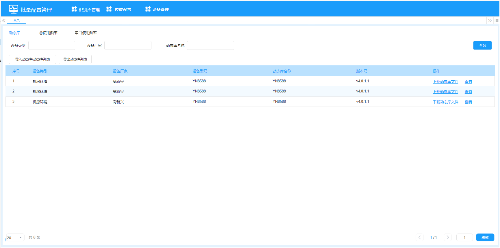

# 协议自动识别系统测试用例

| 项目名称 | 协议自动识别系统 |
|---------|--------------|
| 版本号   | V1.0         |
| 编制日期 | 2026-03-08   |
| 编制人   | make java    |

---

## 一、云端OMC工具测试用例

### 原型参考

**识别库管理**：

**校核配置**：

**设备搜索**：

### 1 识别库管理 - 动态库

#### TC-OMC-LIB-001 动态库列表查询-无条件

| 项目 | 内容 |
|------|------|
| 用例ID | TC-OMC-LIB-001 |
| 优先级 | P1 |
| 前置条件 | 数据库中存在动态库数据 |
| 测试步骤 | 1. 进入识别库管理页面 2. 默认显示动态库Tab 3. 不输入任何查询条件 4. 点击查询 |
| 预期结果 | 显示所有动态库列表，按设备类型-设备厂家排序，分页显示 |

#### TC-OMC-LIB-002 动态库列表查询-设备类型

| 项目 | 内容 |
|------|------|
| 用例ID | TC-OMC-LIB-002 |
| 优先级 | P1 |
| 前置条件 | 数据库中存在多种设备类型的动态库数据 |
| 测试步骤 | 1. 在设备类型输入框输入关键字 2. 点击查询 |
| 预期结果 | 仅显示设备类型包含关键字的动态库列表 |

#### TC-OMC-LIB-003 动态库列表查询-多条件组合

| 项目 | 内容 |
|------|------|
| 用例ID | TC-OMC-LIB-003 |
| 优先级 | P1 |
| 前置条件 | 数据库中存在多种类型的动态库数据 |
| 测试步骤 | 1. 输入设备类型关键字 2. 输入设备厂家关键字 3. 输入动态库名称关键字 4. 点击查询 |
| 预期结果 | 显示同时满足三个条件的动态库列表 |

#### TC-OMC-LIB-004 动态库列表查询-Enter键触发

| 项目 | 内容 |
|------|------|
| 用例ID | TC-OMC-LIB-004 |
| 优先级 | P2 |
| 前置条件 | 同TC-OMC-LIB-002 |
| 测试步骤 | 1. 在任意输入框输入关键字 2. 按Enter键 |
| 预期结果 | 触发搜索，显示过滤后的结果 |

#### TC-OMC-LIB-005 动态库文件下载

| 项目 | 内容 |
|------|------|
| 用例ID | TC-OMC-LIB-005 |
| 优先级 | P1 |
| 前置条件 | 列表中存在有动态库文件的记录 |
| 测试步骤 | 1. 点击某行的"下载动态库文件"按钮 |
| 预期结果 | 对应动态库文件下载到本地 |

#### TC-OMC-LIB-006 查看LUA协议

| 项目 | 内容 |
|------|------|
| 用例ID | TC-OMC-LIB-006 |
| 优先级 | P1 |
| 前置条件 | 列表中存在LUA协议类型的动态库 |
| 测试步骤 | 1. 点击LUA协议行的"查看"按钮 |
| 预期结果 | 打开显示.lua和config.lua文件内容 |

#### TC-OMC-LIB-007 查看旧版协议

| 项目 | 内容 |
|------|------|
| 用例ID | TC-OMC-LIB-007 |
| 优先级 | P1 |
| 前置条件 | 列表中存在旧版协议类型的动态库 |
| 测试步骤 | 1. 点击旧版协议行的"查看"按钮 |
| 预期结果 | 打开显示convertlist文件内容 |

#### TC-OMC-LIB-008 导入动态库列表-CSV正常导入

| 项目 | 内容 |
|------|------|
| 用例ID | TC-OMC-LIB-008 |
| 优先级 | P1 |
| 前置条件 | 准备符合格式的CSV文件 |
| 测试步骤 | 1. 点击"导入动态库列表"按钮 2. 选择CSV文件 3. 确认导入 |
| 预期结果 | 导入成功，列表数据更新 |

#### TC-OMC-LIB-009 导入动态库列表-必填字段为空

| 项目 | 内容 |
|------|------|
| 用例ID | TC-OMC-LIB-009 |
| 优先级 | P1 |
| 前置条件 | CSV文件中某些必填字段为空 |
| 测试步骤 | 1. 导入有空必填字段的CSV文件 |
| 预期结果 | 整份导入失败，提示具体行号和失败原因 |

#### TC-OMC-LIB-010 导入动态库列表-设备型号ID重复

| 项目 | 内容 |
|------|------|
| 用例ID | TC-OMC-LIB-010 |
| 优先级 | P1 |
| 前置条件 | CSV文件中存在重复的设备型号ID |
| 测试步骤 | 1. 导入存在重复设备型号ID的CSV文件 |
| 预期结果 | 整份导入失败，提示设备型号ID重复 |

#### TC-OMC-LIB-011 导入动态库列表-增量更新

| 项目 | 内容 |
|------|------|
| 用例ID | TC-OMC-LIB-011 |
| 优先级 | P1 |
| 前置条件 | 数据库已有数据，CSV含已存在和新的设备型号ID |
| 测试步骤 | 1. 导入包含更新和新增数据的CSV文件 |
| 预期结果 | 已存在的记录更新，新记录增加 |

#### TC-OMC-LIB-012 导入动态库列表-COM通信方式必填校验

| 项目 | 内容 |
|------|------|
| 用例ID | TC-OMC-LIB-012 |
| 优先级 | P1 |
| 前置条件 | CSV中通信方式为COM但波特率等字段为空 |
| 测试步骤 | 1. 导入通信方式为COM但缺少串口配置的CSV |
| 预期结果 | 导入失败，提示COM方式必填字段缺失 |

#### TC-OMC-LIB-013 导入动态库列表-CAN通信方式必填校验

| 项目 | 内容 |
|------|------|
| 用例ID | TC-OMC-LIB-013 |
| 优先级 | P1 |
| 前置条件 | CSV中通信方式为CAN但相关字段为空 |
| 测试步骤 | 1. 导入通信方式为CAN但缺少CAN配置的CSV |
| 预期结果 | 导入失败，提示CAN方式必填字段缺失 |

#### TC-OMC-LIB-014 导入动态库文件-单个txt文件

| 项目 | 内容 |
|------|------|
| 用例ID | TC-OMC-LIB-014 |
| 优先级 | P1 |
| 前置条件 | 已有对应动态库列表记录 |
| 测试步骤 | 1. 点击"导入动态库" 2. 选择convertlist txt文件 3. 确认导入 |
| 预期结果 | 文件导入成功，对应列表记录显示在页面上 |

#### TC-OMC-LIB-015 导入动态库文件-多选文件

| 项目 | 内容 |
|------|------|
| 用例ID | TC-OMC-LIB-015 |
| 优先级 | P2 |
| 前置条件 | 有多个动态库文件和对应列表记录 |
| 测试步骤 | 1. 点击"导入动态库" 2. 同时选择多个文件 3. 确认导入 |
| 预期结果 | 所有文件导入成功 |

#### TC-OMC-LIB-016 导入动态库文件-zip包

| 项目 | 内容 |
|------|------|
| 用例ID | TC-OMC-LIB-016 |
| 优先级 | P1 |
| 前置条件 | zip包包含txt,csv和执行文件 |
| 测试步骤 | 1. 导入zip格式的动态库包 |
| 预期结果 | 自动解压并处理各类文件 |

#### TC-OMC-LIB-017 导出动态库列表

| 项目 | 内容 |
|------|------|
| 用例ID | TC-OMC-LIB-017 |
| 优先级 | P1 |
| 前置条件 | 列表有数据 |
| 测试步骤 | 1. 输入查询条件并查询 2. 点击"导出" |
| 预期结果 | 下载CSV文件，内容为查询结果，字段与导入模板一致 |

#### TC-OMC-LIB-018 动态库分页功能

| 项目 | 内容 |
|------|------|
| 用例ID | TC-OMC-LIB-018 |
| 优先级 | P2 |
| 前置条件 | 列表数据超过一页 |
| 测试步骤 | 1. 查看列表分页组件 2. 切换页码 3. 修改每页显示条数 |
| 预期结果 | 分页正确，数据显示正确 |

### 2 识别库管理 - 总使用频率

#### TC-OMC-FREQ-001 总使用频率列表查询

| 项目 | 内容 |
|------|------|
| 用例ID | TC-OMC-FREQ-001 |
| 优先级 | P1 |
| 前置条件 | 数据库中存在使用频率数据 |
| 测试步骤 | 1. 切换到"总使用频率"Tab 2. 不输入条件点击查询 |
| 预期结果 | 按设备类型+设备子类+概率降序显示列表 |

#### TC-OMC-FREQ-002 总使用频率条件查询

| 项目 | 内容 |
|------|------|
| 用例ID | TC-OMC-FREQ-002 |
| 优先级 | P1 |
| 前置条件 | 存在多种设备类型的频率数据 |
| 测试步骤 | 1. 输入设备类型/子类/动态库名称关键字 2. 点击查询 |
| 预期结果 | 显示符合条件的频率数据 |

#### TC-OMC-FREQ-003 总使用频率导入-全量替换

| 项目 | 内容 |
|------|------|
| 用例ID | TC-OMC-FREQ-003 |
| 优先级 | P1 |
| 前置条件 | 数据库已有频率数据，准备新Excel文件 |
| 测试步骤 | 1. 点击导入 2. 选择Excel文件 3. 确认 |
| 预期结果 | 原有数据清空，导入新数据 |

#### TC-OMC-FREQ-004 总使用频率导出

| 项目 | 内容 |
|------|------|
| 用例ID | TC-OMC-FREQ-004 |
| 优先级 | P1 |
| 前置条件 | 列表有数据 |
| 测试步骤 | 1. 查询后点击导出 |
| 预期结果 | 下载Excel文件，内容为查询结果 |

#### TC-OMC-FREQ-005 概率计算准确性验证

| 项目 | 内容 |
|------|------|
| 用例ID | TC-OMC-FREQ-005 |
| 优先级 | P1 |
| 前置条件 | 已知设备配置数据 |
| 测试步骤 | 1. 手动计算预期概率 2. 与系统显示概率对比 |
| 预期结果 | 概率=(类型+子类+型号+动态库)数量/(类型+子类)数量×100% |

### 3 识别库管理 - 串口使用频率

#### TC-OMC-SERIAL-001 串口使用频率查询

| 项目 | 内容 |
|------|------|
| 用例ID | TC-OMC-SERIAL-001 |
| 优先级 | P1 |
| 前置条件 | 数据库中存在串口频率数据 |
| 测试步骤 | 1. 切换到"串口使用频率"Tab 2. 输入串口号(1-32) 3. 点击查询 |
| 预期结果 | 按串口号+地址位+概率降序显示列表 |

#### TC-OMC-SERIAL-002 串口号范围校验

| 项目 | 内容 |
|------|------|
| 用例ID | TC-OMC-SERIAL-002 |
| 优先级 | P2 |
| 前置条件 | 无 |
| 测试步骤 | 1. 输入串口号为0/33/负数/字母 |
| 预期结果 | 提示输入不合法，限1-32的正整数 |

#### TC-OMC-SERIAL-003 串口使用频率导入导出

| 项目 | 内容 |
|------|------|
| 用例ID | TC-OMC-SERIAL-003 |
| 优先级 | P1 |
| 前置条件 | 准备符合格式的Excel文件 |
| 测试步骤 | 1. 导入Excel 2. 验证数据 3. 导出并对比 |
| 预期结果 | 全量导入成功，导出数据与导入数据一致 |

### 4 校核配置

#### TC-OMC-VC-001 校核配置列表查询

| 项目 | 内容 |
|------|------|
| 用例ID | TC-OMC-VC-001 |
| 优先级 | P1 |
| 前置条件 | 数据库中存在校核配置数据 |
| 测试步骤 | 1. 进入校核配置页面 2. 不输入条件点击查询 |
| 预期结果 | 按设备类型+设备子类+信号ID升序显示列表 |

#### TC-OMC-VC-002 校核配置新增

| 项目 | 内容 |
|------|------|
| 用例ID | TC-OMC-VC-002 |
| 优先级 | P1 |
| 前置条件 | 存在设备类型和子类数据 |
| 测试步骤 | 1. 点击"新增" 2. 选择设备类型 3. 选择设备子类 4. 输入信号名称、信号ID、上限、下限 5. 点击确定 |
| 预期结果 | 新增成功，列表刷新显示新记录 |

#### TC-OMC-VC-003 校核配置新增-必填校验

| 项目 | 内容 |
|------|------|
| 用例ID | TC-OMC-VC-003 |
| 优先级 | P1 |
| 前置条件 | 无 |
| 测试步骤 | 1. 点击"新增" 2. 不填写任何字段 3. 点击确定 |
| 预期结果 | 提示必填字段不能为空 |

#### TC-OMC-VC-004 校核配置新增-唯一性校验

| 项目 | 内容 |
|------|------|
| 用例ID | TC-OMC-VC-004 |
| 优先级 | P1 |
| 前置条件 | 已存在某设备子类+信号ID的记录 |
| 测试步骤 | 1. 新增相同设备子类+信号ID的记录 |
| 预期结果 | 提示该设备子类+信号ID已存在 |

#### TC-OMC-VC-005 校核配置新增-上下限校验

| 项目 | 内容 |
|------|------|
| 用例ID | TC-OMC-VC-005 |
| 优先级 | P2 |
| 前置条件 | 无 |
| 测试步骤 | 1. 输入超出范围的上限/下限值 2. 输入超过4位小数的值 |
| 预期结果 | 提示数值不合法 |

#### TC-OMC-VC-006 校核配置编辑

| 项目 | 内容 |
|------|------|
| 用例ID | TC-OMC-VC-006 |
| 优先级 | P1 |
| 前置条件 | 列表中存在数据 |
| 测试步骤 | 1. 点击某行"编辑"按钮 2. 修改上限值 3. 点击确定 |
| 预期结果 | 编辑成功，列表刷新显示更新后的数据 |

#### TC-OMC-VC-007 校核配置删除-单条

| 项目 | 内容 |
|------|------|
| 用例ID | TC-OMC-VC-007 |
| 优先级 | P1 |
| 前置条件 | 列表中存在数据 |
| 测试步骤 | 1. 点击某行"删除"按钮 2. 确认弹窗中点击"确定" |
| 预期结果 | 删除成功，列表刷新 |

#### TC-OMC-VC-008 校核配置删除-二次确认取消

| 项目 | 内容 |
|------|------|
| 用例ID | TC-OMC-VC-008 |
| 优先级 | P2 |
| 前置条件 | 列表中存在数据 |
| 测试步骤 | 1. 点击某行"删除"按钮 2. 确认弹窗中点击"取消" |
| 预期结果 | 取消删除操作，数据不变 |

#### TC-OMC-VC-009 校核配置批量删除

| 项目 | 内容 |
|------|------|
| 用例ID | TC-OMC-VC-009 |
| 优先级 | P1 |
| 前置条件 | 列表中存在多条数据 |
| 测试步骤 | 1. 勾选多条数据 2. 点击列表上方的"删除"按钮 3. 确认删除 |
| 预期结果 | 选中数据全部删除 |

#### TC-OMC-VC-010 校核配置批量删除-未选择

| 项目 | 内容 |
|------|------|
| 用例ID | TC-OMC-VC-010 |
| 优先级 | P2 |
| 前置条件 | 列表中存在数据 |
| 测试步骤 | 1. 不选择任何数据 2. 点击列表上方的"删除"按钮 |
| 预期结果 | 提示"请先选择数据" |

#### TC-OMC-VC-011 校核配置导入-增量导入

| 项目 | 内容 |
|------|------|
| 用例ID | TC-OMC-VC-011 |
| 优先级 | P1 |
| 前置条件 | 已有数据，Excel含更新和新增数据 |
| 测试步骤 | 1. 点击导入 2. 选择Excel文件 3. 确认 |
| 预期结果 | 根据设备子类+信号ID匹配，相同更新，不同新增 |

#### TC-OMC-VC-012 校核配置导出

| 项目 | 内容 |
|------|------|
| 用例ID | TC-OMC-VC-012 |
| 优先级 | P1 |
| 前置条件 | 列表有数据 |
| 测试步骤 | 1. 查询后点击导出 |
| 预期结果 | 下载Excel文件 |

#### TC-OMC-VC-013 设备类型联动设备子类

| 项目 | 内容 |
|------|------|
| 用例ID | TC-OMC-VC-013 |
| 优先级 | P1 |
| 前置条件 | 存在设备类型和对应子类数据 |
| 测试步骤 | 1. 在新增窗口选择设备类型 2. 查看设备子类下拉框 |
| 预期结果 | 设备子类下拉框自动更新为所选类型下的子类 |

### 5 设备管理 - 设备搜索

#### TC-OMC-DEV-001 搜索当前网段

| 项目 | 内容 |
|------|------|
| 用例ID | TC-OMC-DEV-001 |
| 优先级 | P1 |
| 前置条件 | 同网段存在边缘网关设备 |
| 测试步骤 | 1. 进入设备管理-设备搜索 2. 点击"搜索当前网段" |
| 预期结果 | 显示搜索动画，搜索完成后列表显示同网段设备 |

#### TC-OMC-DEV-002 搜索其他网段

| 项目 | 内容 |
|------|------|
| 用例ID | TC-OMC-DEV-002 |
| 优先级 | P1 |
| 前置条件 | 其他网段存在边缘网关设备 |
| 测试步骤 | 1. 点击"搜索其他网段" 2. 添加IP段 3. 点击检索 |
| 预期结果 | 关闭弹窗，开始搜索，结果显示在列表上 |

#### TC-OMC-DEV-003 网段设置-格式校验

| 项目 | 内容 |
|------|------|
| 用例ID | TC-OMC-DEV-003 |
| 优先级 | P2 |
| 前置条件 | 无 |
| 测试步骤 | 1. 点击"搜索其他网段" 2. 输入非法格式的IP段 |
| 预期结果 | 提示格式不正确 |

#### TC-OMC-DEV-004 网段设置-重复网段

| 项目 | 内容 |
|------|------|
| 用例ID | TC-OMC-DEV-004 |
| 优先级 | P2 |
| 前置条件 | 无 |
| 测试步骤 | 1. 添加两个相同的网段 |
| 预期结果 | 提示网段不能相同 |

#### TC-OMC-DEV-005 已入列表设备自动过滤

| 项目 | 内容 |
|------|------|
| 用例ID | TC-OMC-DEV-005 |
| 优先级 | P1 |
| 前置条件 | 设备列表中已有某设备 |
| 测试步骤 | 1. 搜索当前网段 |
| 预期结果 | 搜索结果中不包含已在设备列表中的设备 |

#### TC-OMC-DEV-006 加入设备列表

| 项目 | 内容 |
|------|------|
| 用例ID | TC-OMC-DEV-006 |
| 优先级 | P1 |
| 前置条件 | 搜索结果中存在设备 |
| 测试步骤 | 1. 点击某设备行的"加入设备列表" |
| 预期结果 | 设备从搜索列表移除，出现在设备列表中 |

#### TC-OMC-DEV-007 批量加入设备列表

| 项目 | 内容 |
|------|------|
| 用例ID | TC-OMC-DEV-007 |
| 优先级 | P1 |
| 前置条件 | 搜索结果中存在多个设备 |
| 测试步骤 | 1. 勾选多个设备 2. 点击"加入设备列表" |
| 预期结果 | 选中设备全部移入设备列表 |

#### TC-OMC-DEV-008 批量加入-未选择

| 项目 | 内容 |
|------|------|
| 用例ID | TC-OMC-DEV-008 |
| 优先级 | P2 |
| 前置条件 | 搜索结果列表有数据 |
| 测试步骤 | 1. 不选择设备 2. 点击"加入设备列表" |
| 预期结果 | 提示"请选择设备" |

#### TC-OMC-DEV-009 清空搜索列表

| 项目 | 内容 |
|------|------|
| 用例ID | TC-OMC-DEV-009 |
| 优先级 | P2 |
| 前置条件 | 搜索列表有数据 |
| 测试步骤 | 1. 点击"清空列表" 2. 确认弹窗点击"确定" |
| 预期结果 | 列表清空 |

#### TC-OMC-DEV-010 搜索结果不持久化

| 项目 | 内容 |
|------|------|
| 用例ID | TC-OMC-DEV-010 |
| 优先级 | P2 |
| 前置条件 | 搜索列表有数据 |
| 测试步骤 | 1. 离开设备搜索页面 2. 重新进入 |
| 预期结果 | 搜索列表为空 |

#### TC-OMC-DEV-011 Tab切换不清空搜索结果

| 项目 | 内容 |
|------|------|
| 用例ID | TC-OMC-DEV-011 |
| 优先级 | P2 |
| 前置条件 | 搜索列表有数据 |
| 测试步骤 | 1. 切换到设备列表Tab 2. 切换回设备搜索Tab |
| 预期结果 | 搜索结果保留 |

### 6 设备管理 - 设备列表

#### TC-OMC-DEV-012 设备列表新增

| 项目 | 内容 |
|------|------|
| 用例ID | TC-OMC-DEV-012 |
| 优先级 | P1 |
| 前置条件 | 目标IP设备可达 |
| 测试步骤 | 1. 点击"新增" 2. 输入IP地址和端口 3. 点击确定 |
| 预期结果 | 自动获取设备信息，新增成功 |

#### TC-OMC-DEV-013 设备列表新增-IP格式校验

| 项目 | 内容 |
|------|------|
| 用例ID | TC-OMC-DEV-013 |
| 优先级 | P2 |
| 前置条件 | 无 |
| 测试步骤 | 1. 输入非法格式的IP地址 |
| 预期结果 | 提示IP格式不正确 |

#### TC-OMC-DEV-014 设备列表导入导出

| 项目 | 内容 |
|------|------|
| 用例ID | TC-OMC-DEV-014 |
| 优先级 | P1 |
| 前置条件 | 准备Excel文件 |
| 测试步骤 | 1. 导入Excel 2. 验证增量导入(IP+端口唯一) 3. 导出并对比 |
| 预期结果 | 导入导出功能正常 |

#### TC-OMC-DEV-015 设备列表删除/批量删除

| 项目 | 内容 |
|------|------|
| 用例ID | TC-OMC-DEV-015 |
| 优先级 | P1 |
| 前置条件 | 列表有数据 |
| 测试步骤 | 1. 单条删除（确认） 2. 批量删除（确认） 3. 未选择时批量删除 |
| 预期结果 | 删除逻辑正确，有二次确认 |

---

## 二、边端批量配置工具测试用例

### 原型参考

**协议自动识别**：

### 7 OMC配置

#### TC-EDGE-OMC-001 OMC配置保存

| 项目 | 内容 |
|------|------|
| 用例ID | TC-EDGE-OMC-001 |
| 优先级 | P1 |
| 前置条件 | OMC服务可达 |
| 测试步骤 | 1. 点击OMC配置图标 2. 输入IP、端口、用户名、密码 3. 点击确定 |
| 预期结果 | 配置成功，自动从OMC获取识别库和校核配置数据 |

#### TC-EDGE-OMC-002 OMC配置-必填校验

| 项目 | 内容 |
|------|------|
| 用例ID | TC-EDGE-OMC-002 |
| 优先级 | P1 |
| 前置条件 | 无 |
| 测试步骤 | 1. 不填写任何字段 2. 点击确定 |
| 预期结果 | 提示必填字段 |

#### TC-EDGE-OMC-003 密码明密文切换

| 项目 | 内容 |
|------|------|
| 用例ID | TC-EDGE-OMC-003 |
| 优先级 | P2 |
| 前置条件 | 无 |
| 测试步骤 | 1. 输入密码 2. 点击密码后方图标切换 |
| 预期结果 | 密码在明文和密文之间切换 |

#### TC-EDGE-OMC-004 定时同步验证

| 项目 | 内容 |
|------|------|
| 用例ID | TC-EDGE-OMC-004 |
| 优先级 | P1 |
| 前置条件 | OMC配置成功 |
| 测试步骤 | 1. 修改定时时间为较短时间 2. 等待定时触发 |
| 预期结果 | 定时从OMC获取最新数据 |

### 8 协议自动识别

#### TC-EDGE-ID-001 连接设备-成功

| 项目 | 内容 |
|------|------|
| 用例ID | TC-EDGE-ID-001 |
| 优先级 | P1 |
| 前置条件 | 目标边缘网关设备可达 |
| 测试步骤 | 1. 输入IP和端口 2. 点击连接设备 |
| 预期结果 | 显示连接成功图标 |

#### TC-EDGE-ID-002 连接设备-失败

| 项目 | 内容 |
|------|------|
| 用例ID | TC-EDGE-ID-002 |
| 优先级 | P1 |
| 前置条件 | 目标设备不可达或IP错误 |
| 测试步骤 | 1. 输入错误IP和端口 2. 点击连接设备 |
| 预期结果 | 显示连接失败图标 |

#### TC-EDGE-ID-003 开始协议自动识别

| 项目 | 内容 |
|------|------|
| 用例ID | TC-EDGE-ID-003 |
| 优先级 | P1 |
| 前置条件 | 设备连接成功 |
| 测试步骤 | 1. 连接设备成功 2. 点击"开始协议自动识别" |
| 预期结果 | 状态变为"协议识别中"，计时开始，结果打印区开始输出 |

#### TC-EDGE-ID-004 未连接时开始识别

| 项目 | 内容 |
|------|------|
| 用例ID | TC-EDGE-ID-004 |
| 优先级 | P1 |
| 前置条件 | 设备未连接 |
| 测试步骤 | 1. 不连接设备 2. 点击"开始协议自动识别" |
| 预期结果 | 提示"请先成功连接设备" |

#### TC-EDGE-ID-005 重复开始识别

| 项目 | 内容 |
|------|------|
| 用例ID | TC-EDGE-ID-005 |
| 优先级 | P2 |
| 前置条件 | 已在协议识别中 |
| 测试步骤 | 1. 再次点击"开始协议自动识别" |
| 预期结果 | 提示"当前已经在协议自动识别中，请勿重复操作" |

#### TC-EDGE-ID-006 停止协议自动识别

| 项目 | 内容 |
|------|------|
| 用例ID | TC-EDGE-ID-006 |
| 优先级 | P1 |
| 前置条件 | 协议识别中 |
| 测试步骤 | 1. 在识别过程中点击"停止协议自动识别" |
| 预期结果 | 识别停止，状态变为"协议识别完成"，计时停止 |

#### TC-EDGE-ID-007 停止按钮状态验证

| 项目 | 内容 |
|------|------|
| 用例ID | TC-EDGE-ID-007 |
| 优先级 | P2 |
| 前置条件 | 无 |
| 测试步骤 | 1. 待开始状态查看停止按钮 2. 识别中查看停止按钮 3. 识别完成查看停止按钮 |
| 预期结果 | 仅识别中状态按钮可用 |

#### TC-EDGE-ID-008 识别状态展示

| 项目 | 内容 |
|------|------|
| 用例ID | TC-EDGE-ID-008 |
| 优先级 | P1 |
| 前置条件 | 无 |
| 测试步骤 | 1. 查看待开始状态（耗时00:00:00.000，设备数--，协议数--） 2. 开始识别，查看识别中状态 3. 识别完成查看最终状态 |
| 预期结果 | 各状态显示正确，计时精确到毫秒 |

#### TC-EDGE-ID-009 结果打印-串口切换

| 项目 | 内容 |
|------|------|
| 用例ID | TC-EDGE-ID-009 |
| 优先级 | P1 |
| 前置条件 | 多个串口正在识别 |
| 测试步骤 | 1. 默认查看串口1的打印 2. 下拉切换到串口2 |
| 预期结果 | 显示对应串口的识别结果 |

#### TC-EDGE-ID-010 结果打印-内容可读性

| 项目 | 内容 |
|------|------|
| 用例ID | TC-EDGE-ID-010 |
| 优先级 | P1 |
| 前置条件 | 识别中或识别完成 |
| 测试步骤 | 1. 查看结果打印内容 |
| 预期结果 | 中文显示，格式清晰，包含参数、实时数据、失败原因 |

#### TC-EDGE-ID-011 下载日志到本地

| 项目 | 内容 |
|------|------|
| 用例ID | TC-EDGE-ID-011 |
| 优先级 | P1 |
| 前置条件 | 有识别日志 |
| 测试步骤 | 1. 点击"下载到本地" |
| 预期结果 | 下载txt文件，命名格式COM1-20260305175309 |

#### TC-EDGE-ID-012 清除日志

| 项目 | 内容 |
|------|------|
| 用例ID | TC-EDGE-ID-012 |
| 优先级 | P2 |
| 前置条件 | 有识别日志 |
| 测试步骤 | 1. 点击"清除日志" |
| 预期结果 | 所有串口的日志清空 |

#### TC-EDGE-ID-013 导出实时数据

| 项目 | 内容 |
|------|------|
| 用例ID | TC-EDGE-ID-013 |
| 优先级 | P1 |
| 前置条件 | 有成功识别的设备实时数据 |
| 测试步骤 | 1. 点击"导出实时数据" |
| 预期结果 | 下载Excel，含设备类型/子类/编码/信号名称/ID/类型/采集值/时间 |

### 9 边端识别库管理

#### TC-EDGE-LIB-001 从OMC同步识别库数据

| 项目 | 内容 |
|------|------|
| 用例ID | TC-EDGE-LIB-001 |
| 优先级 | P1 |
| 前置条件 | OMC配置成功 |
| 测试步骤 | 1. 保存OMC配置 2. 查看识别库管理页面 |
| 预期结果 | 识别库数据与OMC端一致 |

#### TC-EDGE-LIB-002 无OMC手动导入

| 项目 | 内容 |
|------|------|
| 用例ID | TC-EDGE-LIB-002 |
| 优先级 | P1 |
| 前置条件 | 未配置OMC |
| 测试步骤 | 1. 手动导入动态库列表和文件 |
| 预期结果 | 导入成功，功能与OMC端一致 |

### 10 边端校核配置

#### TC-EDGE-VC-001 从OMC同步校核配置

| 项目 | 内容 |
|------|------|
| 用例ID | TC-EDGE-VC-001 |
| 优先级 | P1 |
| 前置条件 | OMC配置成功 |
| 测试步骤 | 1. 保存OMC配置 2. 查看校核配置页面 |
| 预期结果 | 校核配置数据与OMC端一致 |

---

## 三、集成测试用例

#### TC-INT-001 端到端协议自动识别

| 项目 | 内容 |
|------|------|
| 用例ID | TC-INT-001 |
| 优先级 | P1 |
| 前置条件 | 云端OMC已配置识别库和校核配置，边端已配置OMC |
| 测试步骤 | 1. OMC端导入识别库和校核配置 2. 边端同步数据 3. 连接边缘网关设备 4. 开始协议自动识别 5. 等待识别完成 |
| 预期结果 | 识别流程正常，结果打印正确 |

#### TC-INT-002 设备配置数据定时同步

| 项目 | 内容 |
|------|------|
| 用例ID | TC-INT-002 |
| 优先级 | P1 |
| 前置条件 | 设备列表中有边缘网关 |
| 测试步骤 | 1. 等待定时任务触发 2. 查看设备配置数据 3. 查看总使用频率和串口使用频率 |
| 预期结果 | 数据获取成功，频率统计正确 |

#### TC-INT-003 网络中断恢复

| 项目 | 内容 |
|------|------|
| 用例ID | TC-INT-003 |
| 优先级 | P2 |
| 前置条件 | 正常通信中 |
| 测试步骤 | 1. 断开云端与边端网络 2. 等待一段时间 3. 恢复网络 |
| 预期结果 | 下次同步正常执行 |

---

## 四、测试用例统计

| 模块 | 用例数量 | P1 | P2 |
|------|---------|----|----|
| 识别库管理-动态库 | 18 | 14 | 4 |
| 识别库管理-总使用频率 | 5 | 4 | 1 |
| 识别库管理-串口使用频率 | 3 | 2 | 1 |
| 校核配置 | 13 | 8 | 5 |
| 设备管理-设备搜索 | 11 | 6 | 5 |
| 设备管理-设备列表 | 4 | 3 | 1 |
| OMC配置 | 4 | 2 | 2 |
| 协议自动识别 | 13 | 8 | 5 |
| 边端识别库 | 2 | 2 | 0 |
| 边端校核配置 | 1 | 1 | 0 |
| 集成测试 | 3 | 2 | 1 |
| **合计** | **77** | **52** | **25** |
