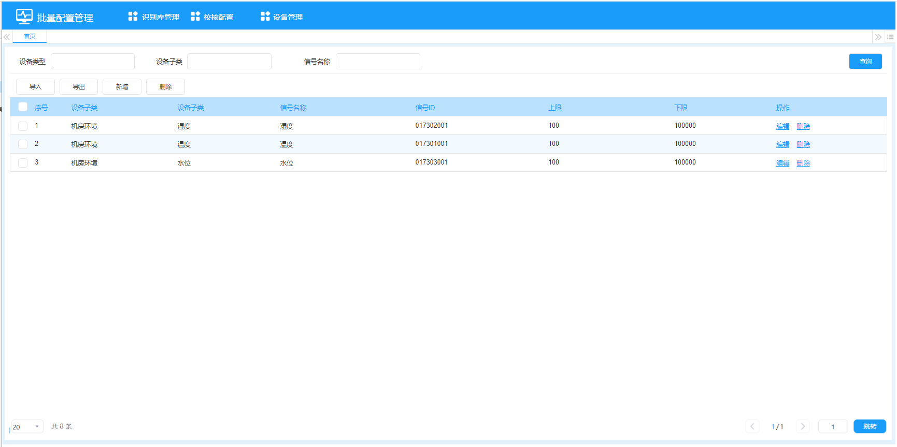
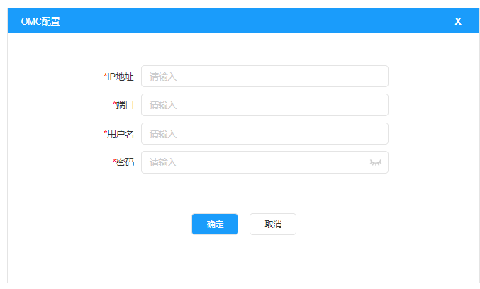

# 协议自动识别系统设计文档

| 项目名称 | 协议自动识别系统 |
|---------|--------------|
| 版本号   | V1.0         |
| 编制日期 | 2026-03-08   |
| 编制人   | make java    |

---

## 1 系统架构设计

### 1.1 总体架构

```
                    ┌──────────────────────────┐
                    │      用户浏览器/客户端      │
                    └─────────┬────────────────┘
                              │
              ┌───────────────┴───────────────┐
              │                               │
    ┌─────────▼─────────┐         ┌───────────▼──────────┐
    │  OMC前端 (Vue3)    │         │  边端前端 (Vue3)      │
    │  Port: 8080        │         │  Port: 8090          │
    └─────────┬─────────┘         └───────────┬──────────┘
              │                               │
    ┌─────────▼─────────┐         ┌───────────▼──────────┐
    │  OMC后端 (Java)    │◄────────│  边端后端 (Go)        │
    │  Port: 9000        │  HTTP   │  Port: 9090          │
    │  Spring Boot       │         │  Gin Framework       │
    └─────────┬─────────┘         └───────────┬──────────┘
              │                               │
    ┌─────────▼─────────┐         ┌───────────▼──────────┐
    │  MySQL (pai)       │         │  SQLite (i-edge.db)  │
    │  Port: 3306        │         │                      │
    └───────────────────┘         └──────────────────────┘
```

### 1.2 技术栈选型

| 层级 | 云端OMC | 边端工具 |
|------|---------|---------|
| 前端框架 | Vue 3 + Element Plus | Vue 3 + Element Plus |
| 构建工具 | Vite | Vite |
| 状态管理 | Pinia | Pinia |
| HTTP客户端 | Axios | Axios |
| 后端框架 | Spring Boot 2.7 | Gin 1.9 |
| ORM | MyBatis-Plus | GORM |
| 数据库 | MySQL 8.0 | SQLite 3 |
| API文档 | Swagger/Knife4j | Swagger |
| 文件处理 | Apache POI / EasyExcel | excelize |

---

## 2 云端OMC工具设计

### 2.1 后端模块设计

#### 2.1.1 包结构

```
com.pai.omc
├── config/                  # 配置类
│   ├── Configuration.java   # 统一配置管理
│   ├── SwaggerConfig.java   # API文档配置
│   └── WebMvcConfig.java    # Web配置
├── controller/              # 控制层
│   ├── DynamicLibraryController.java
│   ├── VerifyConfigController.java
│   └── DeviceController.java
├── service/                 # 服务层接口
│   ├── DynamicLibraryService.java
│   ├── VerifyConfigService.java
│   └── DeviceService.java
├── service/impl/            # 服务层实现
│   ├── DynamicLibraryServiceImpl.java
│   ├── VerifyConfigServiceImpl.java
│   └── DeviceServiceImpl.java
├── mapper/                  # 数据访问层
│   ├── DynamicLibraryMapper.java
│   ├── TotalFrequencyMapper.java
│   ├── SerialFrequencyMapper.java
│   ├── VerifyConfigMapper.java
│   ├── DeviceMapper.java
│   └── DeviceTypeMapper.java
├── entity/                  # 实体类
│   ├── DynamicLibrary.java
│   ├── DynamicLibraryFile.java
│   ├── TotalFrequency.java
│   ├── SerialFrequency.java
│   ├── VerifyConfig.java
│   ├── Device.java
│   ├── DeviceType.java
│   └── DeviceSubtype.java
├── query/                   # 查询参数类
│   ├── DynamicLibraryQuery.java
│   ├── TotalFrequencyQuery.java
│   ├── SerialFrequencyQuery.java
│   ├── VerifyConfigQuery.java
│   └── DeviceQuery.java
├── vo/                      # 视图对象
│   ├── DynamicLibraryVO.java
│   ├── TotalFrequencyVO.java
│   ├── SerialFrequencyVO.java
│   ├── VerifyConfigVO.java
│   ├── DeviceVO.java
│   ├── DeviceSearchVO.java
│   └── PageResultVO.java
├── dto/                     # 数据传输对象
│   ├── VerifyConfigDTO.java
│   ├── DeviceDTO.java
│   └── ImportResultDTO.java
├── common/                  # 通用类
│   ├── Result.java          # 统一返回结果
│   ├── ResultCode.java      # 返回码
│   └── PageResult.java      # 分页结果
├── util/                    # 工具类
│   ├── ExcelUtil.java
│   ├── CsvUtil.java
│   ├── NetworkUtil.java
│   └── FileUtil.java
├── task/                    # 定时任务
│   └── DeviceConfigSyncTask.java
└── exception/               # 异常处理
    ├── BusinessException.java
    └── GlobalExceptionHandler.java
```

#### 2.1.2 数据库表设计（MySQL - pai）

**动态库信息表 omc_dynamic_library**

| 字段 | 类型 | 说明 |
|------|------|------|
| id | BIGINT PK AUTO_INCREMENT | 主键 |
| device_type_name | VARCHAR(100) | 设备类型名称 |
| device_type_id | VARCHAR(50) | 设备类型ID |
| manufacturer | VARCHAR(100) | 设备厂家 |
| manufacturer_id | VARCHAR(50) | 设备厂家ID |
| device_model | VARCHAR(100) | 设备型号 |
| device_model_id | VARCHAR(50) UNIQUE | 设备型号ID |
| library_name | VARCHAR(200) | 动态库名称(配置文件名称) |
| library_id | VARCHAR(50) | 配置文件ID |
| version | VARCHAR(50) | 版本号 |
| comm_address | INTEGER | 通信地址 |
| baud_rate | INTEGER | 波特率 |
| check_bit | VARCHAR(20) | 校验位 |
| data_bit | INTEGER | 数据位 |
| stop_bit | VARCHAR(10) | 停止位 |
| comm_mode | VARCHAR(20) | 通信方式(COM/TCP/CAN) |
| ip_address | VARCHAR(50) | IP地址 |
| comm_port | INTEGER | 通信端口 |
| is_extended_frame | TINYINT | 是否扩展帧 |
| is_can_fd | TINYINT | 是否CAN-FD |
| arbitrate_baud_rate | VARCHAR(50) | 仲裁阶段波特率 |
| data_baud_rate | VARCHAR(50) | 数据阶段波特率 |
| bit_rate_flag | TINYINT | 比特率切换标志 |
| has_file | TINYINT DEFAULT 0 | 是否有动态库文件 |
| create_time | DATETIME | 创建时间 |
| update_time | DATETIME | 更新时间 |

**动态库文件表 omc_dynamic_library_file**

| 字段 | 类型 | 说明 |
|------|------|------|
| id | BIGINT PK AUTO_INCREMENT | 主键 |
| library_name | VARCHAR(200) | 动态库名称 |
| version | VARCHAR(50) | 版本号 |
| file_name | VARCHAR(200) | 原始文件名 |
| file_path | VARCHAR(500) | 存储路径 |
| file_type | VARCHAR(20) | 文件类型(txt/lua/dll/so) |
| file_size | BIGINT | 文件大小(字节) |
| create_time | DATETIME | 创建时间 |
| update_time | DATETIME | 更新时间 |

**总使用频率表 omc_total_frequency**

| 字段 | 类型 | 说明 |
|------|------|------|
| id | BIGINT PK AUTO_INCREMENT | 主键 |
| device_type | VARCHAR(100) | 设备类型 |
| device_subtype | VARCHAR(100) | 设备子类 |
| device_model | VARCHAR(100) | 设备型号 |
| library_name | VARCHAR(200) | 动态库名称 |
| frequency | DECIMAL(10,4) | 使用概率 |
| count | INTEGER | 使用数量 |
| total_count | INTEGER | 该类型总数 |
| create_time | DATETIME | 创建时间 |
| update_time | DATETIME | 更新时间 |

**串口使用频率表 omc_serial_frequency**

| 字段 | 类型 | 说明 |
|------|------|------|
| id | BIGINT PK AUTO_INCREMENT | 主键 |
| serial_num | INTEGER | 串口号 |
| device_address | INTEGER | 地址位 |
| device_type | VARCHAR(100) | 设备类型 |
| device_subtype | VARCHAR(100) | 设备子类 |
| device_model | VARCHAR(100) | 设备型号 |
| library_name | VARCHAR(200) | 动态库名称 |
| frequency | DECIMAL(10,4) | 使用概率 |
| count | INTEGER | 使用数量 |
| total_count | INTEGER | 该维度总数 |
| create_time | DATETIME | 创建时间 |
| update_time | DATETIME | 更新时间 |

**校核配置表 omc_verify_config**

| 字段 | 类型 | 说明 |
|------|------|------|
| id | BIGINT PK AUTO_INCREMENT | 主键 |
| device_type_id | VARCHAR(50) | 设备类型ID |
| device_type_name | VARCHAR(100) | 设备类型名称 |
| device_subtype_id | VARCHAR(50) | 设备子类ID |
| device_subtype_name | VARCHAR(100) | 设备子类名称 |
| channel_name | VARCHAR(100) | 信号名称 |
| channel_code | VARCHAR(100) | 信号ID |
| upper_limit | DECIMAL(15,4) | 上限 |
| lower_limit | DECIMAL(15,4) | 下限 |
| create_time | DATETIME | 创建时间 |
| update_time | DATETIME | 更新时间 |

**设备列表表 omc_device**

| 字段 | 类型 | 说明 |
|------|------|------|
| id | BIGINT PK AUTO_INCREMENT | 主键 |
| ip_address | VARCHAR(50) | IP地址 |
| port | INTEGER | 端口 |
| device_code | VARCHAR(100) | 设备编码 |
| device_name | VARCHAR(200) | 设备名称 |
| software_version | VARCHAR(50) | 软件版本 |
| b_interface_version | VARCHAR(50) | B接口版本 |
| site_name | VARCHAR(200) | 站点名称 |
| create_time | DATETIME | 创建时间 |
| update_time | DATETIME | 更新时间 |

**设备配置数据表 omc_device_config**

| 字段 | 类型 | 说明 |
|------|------|------|
| id | BIGINT PK AUTO_INCREMENT | 主键 |
| device_id | BIGINT | 关联omc_device.id |
| device_code | VARCHAR(100) | 边缘网关设备编码 |
| sub_device_code | VARCHAR(100) | 下挂设备编码 |
| device_type | VARCHAR(100) | 设备类型 |
| device_subtype | VARCHAR(100) | 设备子类 |
| device_model | VARCHAR(100) | 设备型号 |
| library_name | VARCHAR(200) | 动态库名称 |
| serial_num | INTEGER | 串口号 |
| device_address | INTEGER | 地址位 |
| create_time | DATETIME | 创建时间 |
| update_time | DATETIME | 更新时间 |

**设备类型表 omc_device_type**

| 字段 | 类型 | 说明 |
|------|------|------|
| id | BIGINT PK AUTO_INCREMENT | 主键 |
| type_id | VARCHAR(50) UNIQUE | 类型ID |
| type_name | VARCHAR(100) | 类型名称 |
| protocol_type | INTEGER | 协议类型 |

**设备子类表 omc_device_subtype**

| 字段 | 类型 | 说明 |
|------|------|------|
| id | BIGINT PK AUTO_INCREMENT | 主键 |
| subtype_id | VARCHAR(50) UNIQUE | 子类ID |
| subtype_name | VARCHAR(100) | 子类名称 |
| type_id | VARCHAR(50) | 关联设备类型ID |
| protocol_type | INTEGER | 协议类型 |

#### 2.1.3 核心接口设计

**识别库管理接口**

```
GET    /api/library/page              - 分页查询动态库列表
POST   /api/library/import-list       - 导入动态库列表(CSV)
POST   /api/library/import-file       - 导入动态库文件
GET    /api/library/export            - 导出动态库列表(CSV)
GET    /api/library/download/{id}     - 下载动态库文件
GET    /api/library/view/{id}         - 查看动态库配置

GET    /api/frequency/total/page      - 分页查询总使用频率
POST   /api/frequency/total/import    - 导入总使用频率
GET    /api/frequency/total/export    - 导出总使用频率

GET    /api/frequency/serial/page     - 分页查询串口使用频率
POST   /api/frequency/serial/import   - 导入串口使用频率
GET    /api/frequency/serial/export   - 导出串口使用频率
```

**校核配置接口**

```
GET    /api/verify-config/page        - 分页查询
POST   /api/verify-config/add         - 新增
PUT    /api/verify-config/update      - 编辑
DELETE /api/verify-config/delete       - 删除
DELETE /api/verify-config/batch-delete - 批量删除
POST   /api/verify-config/import      - 导入
GET    /api/verify-config/export      - 导出
```

**设备管理接口**

```
POST   /api/device/search-current     - 搜索当前网段
POST   /api/device/search-other       - 搜索其他网段
POST   /api/device/add-to-list        - 加入设备列表
POST   /api/device/batch-add-to-list  - 批量加入设备列表

GET    /api/device/page               - 分页查询设备列表
POST   /api/device/add                - 新增设备
PUT    /api/device/update             - 编辑设备
DELETE /api/device/delete             - 删除设备
DELETE /api/device/batch-delete       - 批量删除
POST   /api/device/import             - 导入设备
GET    /api/device/export             - 导出设备

GET    /api/device-type/list          - 设备类型列表
GET    /api/device-subtype/list       - 设备子类列表(按类型)
```

### 2.2 前端模块设计

#### 2.2.1 页面路由

```
/                                → 重定向到 /library
/library                         → 识别库管理
  /library/dynamic-lib           → 动态库Tab
  /library/total-frequency       → 总使用频率Tab
  /library/serial-frequency      → 串口使用频率Tab
/verify-config                   → 校核配置
/device                          → 设备管理
  /device/search                 → 设备搜索Tab
  /device/list                   → 设备列表Tab
```

#### 2.2.2 原型参考

**识别库管理原型**：


**校核配置原型**：



**设备搜索原型**：


**设备列表原型**：


#### 2.2.3 组件结构

```
src/
├── views/
│   ├── library/
│   │   ├── index.vue            # 识别库管理主页(Tab切换)
│   │   ├── DynamicLibTab.vue    # 动态库Tab
│   │   ├── TotalFreqTab.vue     # 总使用频率Tab
│   │   └── SerialFreqTab.vue    # 串口使用频率Tab
│   ├── verify-config/
│   │   ├── index.vue            # 校核配置主页
│   │   └── ConfigDialog.vue     # 新增/编辑弹窗
│   └── device/
│       ├── index.vue            # 设备管理主页(Tab切换)
│       ├── DeviceSearchTab.vue  # 设备搜索Tab
│       ├── DeviceListTab.vue    # 设备列表Tab
│       ├── SubnetDialog.vue     # 网段设置弹窗
│       └── DeviceDialog.vue     # 新增/编辑设备弹窗
├── components/
│   ├── SearchBar.vue            # 搜索栏组件
│   ├── ImportDialog.vue         # 导入弹窗组件
│   └── Pagination.vue           # 分页组件
├── api/
│   ├── library.js
│   ├── frequency.js
│   ├── verifyConfig.js
│   └── device.js
├── router/
│   └── index.js
├── store/
│   └── index.js
└── utils/
    ├── request.js               # Axios封装
    └── common.js
```

---

## 3 边端批量配置工具设计

### 3.1 后端模块设计

#### 3.1.1 包结构

```
edge-tool/edge-backend/
├── main.go
├── go.mod
├── go.sum
├── config/
│   ├── config.go                # 配置管理
│   └── config.yaml              # 配置文件
├── router/
│   └── router.go                # 路由定义
├── controller/
│   ├── omc_config_controller.go
│   ├── identify_controller.go
│   ├── library_controller.go
│   └── verify_config_controller.go
├── service/
│   ├── omc_config_service.go
│   ├── identify_service.go
│   ├── library_service.go
│   ├── verify_config_service.go
│   └── sync_service.go          # OMC数据同步服务
├── model/
│   ├── dynamic_library.go
│   ├── dll_identify.go
│   ├── dll_identify_range.go
│   ├── device.go
│   ├── device_type.go
│   ├── omc_config.go
│   └── identify_result.go
├── query/
│   ├── library_query.go
│   └── verify_config_query.go
├── vo/
│   ├── library_vo.go
│   ├── verify_config_vo.go
│   ├── identify_vo.go
│   └── response.go
├── middleware/
│   └── cors.go
├── util/
│   ├── excel.go
│   ├── csv.go
│   ├── network.go
│   └── serial.go               # 串口通信工具
└── protocol/
    ├── identifier.go            # 协议识别核心引擎
    ├── serial_comm.go           # 串口通信
    └── data_collector.go        # 实时数据采集
```

#### 3.1.2 边端新增表（SQLite - i-edge.db）

**OMC配置表 tab_omc_config**

| 字段 | 类型 | 说明 |
|------|------|------|
| id | INTEGER PK AUTOINCREMENT | 主键 |
| ip_address | TEXT | OMC IP地址 |
| port | TEXT | OMC端口 |
| username | TEXT | 用户名 |
| password | TEXT | 密码(加密存储) |
| last_sync_time | TEXT | 最后同步时间 |
| create_time | TEXT | 创建时间 |
| update_time | TEXT | 更新时间 |

**协议识别结果表 tab_identify_result**

| 字段 | 类型 | 说明 |
|------|------|------|
| id | INTEGER PK AUTOINCREMENT | 主键 |
| session_id | TEXT | 识别会话ID |
| serial_num | INTEGER | 串口号 |
| device_address | INTEGER | 设备地址 |
| device_type | TEXT | 设备类型 |
| device_subtype | TEXT | 设备子类 |
| library_name | TEXT | 动态库名称 |
| status | INTEGER | 状态(0:失败,1:成功) |
| fail_reason | TEXT | 失败原因 |
| identify_time | TEXT | 识别时间 |
| create_time | TEXT | 创建时间 |

**识别实时数据表 tab_identify_realtime_data**

| 字段 | 类型 | 说明 |
|------|------|------|
| id | INTEGER PK AUTOINCREMENT | 主键 |
| session_id | TEXT | 识别会话ID |
| device_type | TEXT | 设备类型 |
| device_subtype | TEXT | 设备子类 |
| device_code | TEXT | 设备编码 |
| channel_name | TEXT | 信号名称 |
| channel_code | TEXT | 信号ID |
| channel_type | INTEGER | 信号类型 |
| collect_value | TEXT | 采集值 |
| collect_time | TEXT | 采集时间 |

#### 3.1.3 核心接口设计

**OMC配置接口**

```
GET    /api/omc-config               - 获取OMC配置
POST   /api/omc-config/save          - 保存OMC配置
POST   /api/omc-config/sync          - 手动触发同步
```

**协议自动识别接口**

```
POST   /api/identify/connect         - 连接设备
POST   /api/identify/start           - 开始协议自动识别
POST   /api/identify/stop            - 停止协议自动识别
GET    /api/identify/status           - 获取识别状态
GET    /api/identify/log/{serialNum}  - 获取串口识别日志
GET    /api/identify/export           - 导出实时数据
WS     /ws/identify/progress          - WebSocket实时推送
```

**识别库管理接口**

```
GET    /api/library/page              - 分页查询
POST   /api/library/import-list       - 导入列表
POST   /api/library/import-file       - 导入文件
GET    /api/library/export            - 导出
GET    /api/library/download/{id}     - 下载
GET    /api/frequency/total/page      - 总使用频率
GET    /api/frequency/serial/page     - 串口使用频率
```

**校核配置接口**

```
GET    /api/verify-config/page        - 分页查询
POST   /api/verify-config/add         - 新增
PUT    /api/verify-config/update      - 编辑
DELETE /api/verify-config/delete       - 删除
POST   /api/verify-config/import      - 导入
GET    /api/verify-config/export      - 导出
```

### 3.2 前端模块设计

#### 3.2.1 原型参考

**边端主界面原型**：


**OMC配置弹窗原型**：



**协议自动识别原型**：


#### 3.2.2 页面路由

```
/                                → 重定向到 /identify
/identify                        → 协议自动识别（默认页面）
/library                         → 识别库管理
/verify-config                   → 校核配置
```

#### 3.2.2 组件结构

```
src/
├── views/
│   ├── identify/
│   │   └── index.vue            # 协议自动识别页面
│   ├── library/
│   │   ├── index.vue            # 识别库管理
│   │   ├── DynamicLibTab.vue
│   │   ├── TotalFreqTab.vue
│   │   └── SerialFreqTab.vue
│   └── verify-config/
│       ├── index.vue
│       └── ConfigDialog.vue
├── components/
│   ├── OmcConfigDialog.vue      # OMC配置弹窗
│   ├── SearchBar.vue
│   └── ImportDialog.vue
├── api/
│   ├── identify.js
│   ├── library.js
│   ├── verifyConfig.js
│   └── omcConfig.js
├── router/
│   └── index.js
└── store/
    ├── index.js
    └── identify.js              # 识别状态管理
```

---

## 4 协议自动识别核心流程

### 4.1 识别流程图

```
开始协议自动识别
        │
        ▼
   连接边缘网关设备
        │
        ▼
   获取设备串口配置
        │
        ▼
┌──────────────────┐
│ 遍历每个串口      │◄─────────────────┐
└────────┬─────────┘                  │
         ▼                            │
┌──────────────────┐                  │
│ 遍历每个地址位    │◄────────────┐    │
└────────┬─────────┘             │    │
         ▼                       │    │
  从识别库获取该串口+地址位        │    │
  对应的动态库列表(按概率排序)     │    │
         │                       │    │
         ▼                       │    │
┌──────────────────┐             │    │
│ 遍历动态库列表    │◄──────┐    │    │
└────────┬─────────┘       │    │    │
         ▼                  │    │    │
  加载动态库配置              │    │    │
  发送采集指令                │    │    │
         │                  │    │    │
         ▼                  │    │    │
  接收实时数据?              │    │    │
    │是      │否             │    │    │
    ▼        ▼              │    │    │
  校核数据  标记失败          │    │    │
  在范围内?  (无响应)   ─────┘    │    │
    │是    │否                    │    │
    ▼      ▼                     │    │
  标记成功  标记失败              │    │
  记录结果  (数据异常)           │    │
    │       │                    │    │
    ▼       ▼                    │    │
  打印结果  打印结果(含失败原因)  │    │
         │                       │    │
         ▼                       │    │
   是否还有地址位? ──────────────┘    │
         │否                          │
         ▼                            │
   是否还有串口? ─────────────────────┘
         │否
         ▼
   协议识别完成
```

### 4.2 校核逻辑

```
对于每个成功采集到的实时数据点：
  1. 根据设备子类+信号ID查找校核配置
  2. 若找到配置：
     a. 判断采集值是否在[下限, 上限]范围内
     b. 在范围内 → 该信号校核通过
     c. 不在范围内 → 该信号校核失败
  3. 若未找到配置：
     a. 跳过校核，视为通过
  4. 所有关键信号校核通过 → 该协议识别成功
  5. 存在关键信号校核失败 → 该协议识别失败
```

### 4.3 概率计算逻辑

**总使用频率**

```sql
-- 统计每个维度的数量
SELECT device_type, device_subtype, device_model, library_name, 
       COUNT(*) as cnt
FROM omc_device_config
GROUP BY device_type, device_subtype, device_model, library_name;

-- 统计每个类型+子类的总数
SELECT device_type, device_subtype, COUNT(*) as total
FROM omc_device_config
GROUP BY device_type, device_subtype;

-- 概率 = cnt / total * 100%
```

**串口使用频率**

```sql
-- 统计每个维度的数量
SELECT serial_num, device_address, device_type, device_subtype, 
       device_model, library_name, COUNT(*) as cnt
FROM omc_device_config
GROUP BY serial_num, device_address, device_type, device_subtype, 
         device_model, library_name;

-- 统计每个串口+地址位+类型+子类的总数
SELECT serial_num, device_address, device_type, device_subtype, 
       COUNT(*) as total
FROM omc_device_config
GROUP BY serial_num, device_address, device_type, device_subtype;

-- 概率 = cnt / total * 100%
```

---

## 5 数据同步设计

### 5.1 云端定时任务

- 默认每10天执行一次（可配置）
- 遍历设备列表中的所有边缘网关
- 通过HTTP接口获取每台设备的配置数据
- 更新设备配置数据表
- 重新计算使用频率

### 5.2 边端数据同步

- 配置OMC后立即同步一次
- 之后每天定时同步（可配置）
- 同步内容：识别库数据、校核配置数据
- 同步方式：HTTP GET请求OMC接口

---

## 6 安全设计

### 6.1 密码加密

- 边端OMC配置密码使用AES-256加密存储
- 传输使用HTTPS（生产环境）

### 6.2 接口安全

- 云端接口使用Token认证
- 边端访问云端接口需携带认证信息

---

## 7 部署架构

```
┌─────────────────────────────────────┐
│          云端服务器                    │
│  ┌───────┐  ┌──────┐  ┌──────────┐ │
│  │ Nginx │──│ Java │──│  MySQL   │ │
│  │ :80   │  │ :9000│  │  :3306   │ │
│  └───────┘  └──────┘  └──────────┘ │
│  ┌───────────────────┐             │
│  │  Vue静态文件(:8080)│             │
│  └───────────────────┘             │
└─────────────────────────────────────┘

┌─────────────────────────────────────┐
│          边缘网关/本地PC              │
│  ┌───────┐  ┌──────┐  ┌──────────┐ │
│  │ Nginx │──│  Go  │──│  SQLite  │ │
│  │ :80   │  │ :9090│  │ i-edge.db│ │
│  └───────┘  └──────┘  └──────────┘ │
│  ┌───────────────────┐             │
│  │  Vue静态文件(:8090)│             │
│  └───────────────────┘             │
└─────────────────────────────────────┘
```
