# 协议自动识别系统需求规格说明书

| 项目名称 | 协议自动识别系统 |
|---------|--------------|
| 版本号   | V1.0         |
| 编制日期 | 2026-03-08   |
| 编制人   | make java    |
| 审核人   |              |

---

## 1 引言

### 1.1 编写目的

本文档旨在详细描述协议自动识别系统的功能需求、非功能需求和业务规则，为系统设计、开发、测试提供依据。

### 1.2 项目背景

在动力环境监控领域，边缘网关设备需要通过不同的通信协议与各类监控设备进行通信。目前协议配置依赖人工逐一配置，效率低、易出错。本系统旨在实现协议自动识别，通过统计各动态库使用频率、校核采集数据等方式，自动完成协议识别与配置，提升运维效率。

### 1.3 术语定义

| 术语 | 定义 |
|------|------|
| OMC | 操作维护中心（Operation and Maintenance Center），云端管理工具 |
| 边缘网关 | 部署在站点现场的物联网边缘计算设备（i-edge） |
| 动态库 | 设备通信协议的实现文件（.dll/.so/.lua等），用于解析设备数据 |
| 识别库 | 动态库及其关联的设备类型、使用频率等信息的集合 |
| 校核配置 | 用于验证协议识别正确性的数据范围配置（信号上下限等） |
| FSU | 现场监控单元（Field Supervision Unit） |
| 串口 | 设备通信使用的串行端口（COM口） |
| 设备子类 | 设备类型下的细分分类，如"开关电源"下的"艾默生"等 |
| convertlist | 旧版协议的通道转换配置文件 |
| LUA协议 | 使用Lua脚本语言编写的新版通信协议 |

### 1.4 系统架构概述

系统分为两个子项目、4个模块：

**一、云端OMC工具**
- 模块1：云端OMC工具前端（Vue）
- 模块2：云端OMC工具后端（Java、MySQL，实例名：pai）

**二、边端批量配置工具**
- 模块3：边端批量配置工具前端（Vue）
- 模块4：边端批量配置工具后端（Go、SQLite，文件名：i-edge.db）

```
┌─────────────────────────────────────────────────────────┐
│                      云端OMC工具                         │
│  ┌──────────┐  ┌──────────┐  ┌──────────┐              │
│  │ 识别库管理 │  │ 校核配置  │  │ 设备管理  │              │
│  └──────────┘  └──────────┘  └──────────┘              │
│  ┌──────────────────────────────────────┐              │
│  │          Java后端 + MySQL             │              │
│  └──────────────────────────────────────┘              │
└────────────────────┬────────────────────────────────────┘
                     │ HTTP API
┌────────────────────▼────────────────────────────────────┐
│                   边端批量配置工具                         │
│  ┌──────────┐  ┌──────────┐  ┌──────────┐  ┌────────┐ │
│  │ OMC配置   │  │协议自动识别│  │ 识别库管理 │  │校核配置 │ │
│  └──────────┘  └──────────┘  └──────────┘  └────────┘ │
│  ┌──────────────────────────────────────┐              │
│  │          Go后端 + SQLite              │              │
│  └──────────────────────────────────────┘              │
└─────────────────────────────────────────────────────────┘
```

### 1.5 用户角色

| 角色 | 描述 |
|------|------|
| OMC管理员 | 使用云端OMC工具管理识别库、校核配置和设备 |
| 现场运维人员 | 使用边端批量配置工具进行协议自动识别 |

---

## 2 云端OMC工具功能需求

### 2.1 识别库管理

#### 2.1.1 功能概述

管理各省市对应的动态库、统计各动态库的使用率，为协议自动识别提供数据支撑。主要在自动识别协议的过程中，采集到实时数据后，用来判断是否符合条件，若是符合，则协议正确，若是不符合，则协议不正确。用于发现边缘网关设备并管理边缘网关设备，以便能获取边缘网关的设备配置信息进行统计。

#### 2.1.2 动态库管理

**页面布局**：页面分为三个Tab页：动态库、总使用频率、串口使用频率，默认显示动态库Tab。

##### 查询条件

| 字段 | 类型 | 限制 | 默认值 | 说明 |
|------|------|------|--------|------|
| 设备类型 | 文本 | 50字符 | 空 | 支持关键字搜索，为空查全部 |
| 设备厂家 | 文本 | 50字符 | 空 | 支持关键字搜索，为空查全部 |
| 动态库名称 | 文本 | 50字符 | 空 | 支持关键字搜索，为空查全部 |

- 支持点击"查询"按钮或按Enter键触发搜索

##### 列表字段

| 序号 | 字段名 | 说明 |
|------|--------|------|
| 1 | 序号 | 自动编号 |
| 2 | 设备类型 | 设备大类名称 |
| 3 | 设备厂家 | 设备制造商 |
| 4 | 设备型号 | 设备具体型号 |
| 5 | 动态库名称 | 协议动态库文件名 |
| 6 | 版本号 | 动态库版本 |
| 7 | 操作 | 下载动态库文件、查看 |

- 列表按"设备类型-设备厂家"排序，数据过多时支持分页显示
- **下载动态库文件**：将对应动态库文件下载到本地
- **查看**：
  - LUA协议：打开.lua和config.lua文件
  - 旧版协议：打开convertlist文件

##### 导入动态库/动态库列表

**导入动态库**：
- 根据动态库名称确定唯一性，名称相同更新，不同新增
- 支持文件格式：txt（convertlist协议）、csv（动态库列表）、zip（打包文件）、lua（lua协议）、可执行文件（动态库）
- 支持多选文件导入
- 导入的文件按"动态库名称+版本号"与动态库列表做匹配

**导入动态库列表**（CSV格式）：

导入模板：


| 导入字段 | 必填要求 |
|---------|---------|
| 设备类型 | 非空 |
| 设备类型ID | 非空 |
| 设备厂家 | 非空 |
| 设备厂家ID | 非空 |
| 设备型号 | 非空 |
| 设备型号ID | 唯一 |
| 配置文件名称 | 非空 |
| 配置文件ID | 非空 |
| 通信地址 | 非空 |
| 波特率 | 通信方式为COM时必填 |
| 校验位 | 通信方式为COM时必填 |
| 数据位 | 通信方式为COM时必填 |
| 停止位 | 通信方式为COM时必填 |
| 通信方式 | - |
| IP地址 | - |
| 通信端口 | - |
| 是否扩展帧 | 通信方式为CAN时必填 |
| 是否CAN-FD | 通信方式为CAN时必填 |
| 仲裁阶段波特率 | 通信方式为CAN时必填 |
| 数据阶段波特率 | 通信方式为CAN时必填 |
| 比特率切换标志 | 通信方式为CAN时必填 |

- 增量导入，根据设备型号ID做唯一性匹配，相同则更新，不同则增加
- 失败时整份失败，提示原因：第XX行【失败原因】;第XX行【失败原因】
- 导入成功后，仅显示有对应动态库文件的记录；导入动态库文件后获取版本，存在相同版本则更新文件，不存在则自动添加版本信息

##### 导出动态库列表

- 格式：CSV，导出字段与导入模板一致
- 导出查询结果数据

#### 2.1.3 总使用频率

##### 功能描述

统计每个动态库的使用概率，概率高的优先识别，提高识别效率。

##### 查询条件

| 字段 | 类型 | 限制 | 默认值 |
|------|------|------|--------|
| 设备类型 | 文本 | 50字符 | 空 |
| 设备子类 | 文本 | 50字符 | 空 |
| 动态库名称 | 文本 | 50字符 | 空 |

##### 列表字段

序号、设备类型、设备子类、设备型号、动态库名称、概率

- 按"设备类型+设备子类+概率"降序排列，分页显示

##### 数据来源

- 每10天（可配置）从设备管理中获取边缘网关的物联设备配置数据
- 更新规则：根据设备编码更新，存在则更新，不存在新增，多余的删除
- **概率计算公式**：`概率 = (设备类型+设备子类+设备型号+动态库名称)的数量 / (设备类型+设备子类)的数量 × 100%`

##### 导入/导出

- 导入：Excel格式，**全量导入**（清空现有数据）
- 导出：Excel格式，导出查询结果

#### 2.1.4 串口使用频率

##### 功能描述

统计每个串口及地址位对应协议的概率，提高识别效率。

##### 查询条件

| 字段 | 类型 | 限制 | 默认值 |
|------|------|------|--------|
| 串口号 | 数值 | 正整数，1-32 | 空 |
| 地址位 | 数值 | 正整数，1-32 | 空 |
| 设备类型 | 文本 | 50字符 | 空 |
| 设备子类 | 文本 | 50字符 | 空 |
| 动态库名称 | 文本 | 50字符 | 空 |

##### 列表字段

序号、串口号、地址位、设备类型、设备子类、设备型号、动态库名称、概率

- 按"串口号+地址位+设备类型+设备子类+动态库名称+概率"降序排序
- **概率计算**：`概率 = (串口号+地址位+设备类型+设备子类+设备型号+动态库名称)的数量 / (串口号+地址位+设备类型+设备子类)的数量 × 100%`

##### 导入/导出

- 导入：Excel格式，全量导入
- 导出：Excel格式，导出查询结果

#### 2.1.5 原型界面

**动态库列表**：


**总使用频率**：

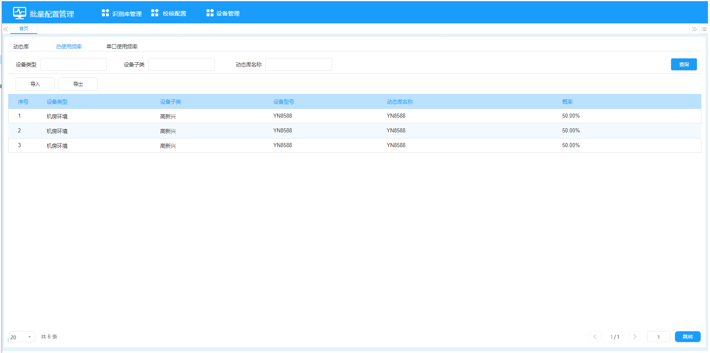

**串口使用频率**：

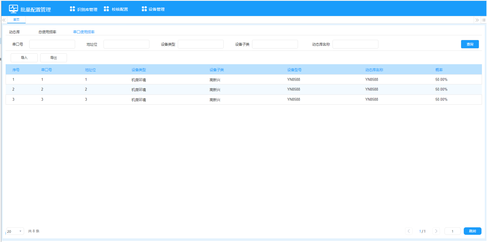

---

### 2.2 校核配置

#### 2.2.1 功能概述

管理协议自动识别过程中的校核规则。采集到实时数据后，判断数据是否在配置的上下限范围内，符合则协议正确，不符合则协议不正确。

#### 2.2.2 查询条件

| 字段 | 类型 | 限制 | 默认值 |
|------|------|------|--------|
| 设备类型 | 文本 | 50字符 | 空 |
| 设备子类 | 文本 | 50字符 | 空 |
| 信号名称 | 文本 | 50字符 | 空 |

#### 2.2.3 列表字段

序号、设备类型、设备子类、信号名称、信号ID、上限、下限、操作（编辑、删除）

- 按"设备类型+设备子类+信号ID"升序排列，分页显示

#### 2.2.4 新增/编辑

| 字段 | 类型 | 必填 | 限制 |
|------|------|------|------|
| 设备类型 | 枚举下拉 | 是 | 支持关键字过滤 |
| 设备子类 | 枚举下拉 | 是 | 与设备类型联动 |
| 信号名称 | 文本 | 是 | 50字符 |
| 信号ID | 文本 | 是 | 50字符 |
| 上限 | 数值 | 是 | -999999999~999999999，最多4位小数 |
| 下限 | 数值 | 是 | -999999999~999999999，最多4位小数 |

- 唯一性约束：设备子类+信号ID

#### 2.2.5 删除/批量删除

- 单条删除：二次确认"确认删除本条数据？"
- 批量删除：选中多条后删除，二次确认"确认删除选中数据？"
- 未选中数据点击删除提示"请先选择数据"

#### 2.2.6 导入/导出

- 导入：Excel格式，增量导入，根据"设备子类+信号ID"匹配
- 导出：Excel格式，导出查询结果

#### 2.2.7 原型界面


---

### 2.3 设备管理

#### 2.3.1 功能概述

发现并管理边缘网关设备，获取设备配置信息进行统计分析。

#### 2.3.2 设备搜索

##### 查询条件

| 字段 | 类型 | 限制 | 默认值 |
|------|------|------|--------|
| IP地址 | 文本 | 50字符 | 空 |
| 设备编码 | 文本 | 50字符 | 空 |
| 站点名称 | 文本 | 50字符 | 空 |

##### 列表字段

序号、IP地址、端口、设备编码、设备名称、软件版本、B接口版本、站点名称、操作（加入设备列表）

- 列表默认为空，搜索后显示结果
- 离开页面后再进入列表清空（Tab切换不影响）
- 已在设备列表中的设备搜索时自动过滤

##### 搜索当前网段

- 根据OMC部署服务器IP的网段搜索边缘网关
- 同网段定义：前三段IP相同（如服务器IP为255.255.255.X，则搜索同网段设备）
- 搜索过程中页面禁用，显示搜索动画

##### 搜索其他网段

- 弹出网段设置窗口
- 支持添加多个IP段（格式：起始IP-结束IP）
- 网段之间不能相同，至少设置一个
- 支持删除已添加的网段（不做二次确认）

##### 加入设备列表/批量加入

- 单个加入：点击行操作按钮
- 批量加入：选择多条后点击批量操作按钮
- 未选择设备时提示"请选择设备"

##### 清空列表

- 二次确认："确认清空列表？"

#### 2.3.3 设备列表

##### 查询条件

同设备搜索查询条件（IP地址、设备编码、站点名称）

##### 列表字段

序号、IP地址、端口、设备编码、设备名称、软件版本、B接口版本、站点名称、操作（编辑、删除）

- 按新增时间降序排列，分页显示

##### 新增/编辑

| 字段 | 类型 | 必填 | 可编辑 | 说明 |
|------|------|------|--------|------|
| IP地址 | 文本 | 是 | 是 | 格式：0.0.0.0 |
| 端口 | 数值 | 是 | 是 | 0-65535 |
| 设备编码 | 文本 | - | 否 | 根据IP和端口自动获取 |
| 设备名称 | 文本 | - | 否 | 根据IP和端口自动获取 |
| 软件版本 | 文本 | - | 否 | 根据IP和端口自动获取 |
| B接口版本 | 文本 | - | 否 | 根据IP和端口自动获取 |
| 站点名称 | 文本 | - | 否 | 根据IP和端口自动获取 |

##### 导入/导出

- 导入：Excel格式，增量导入，根据"IP+端口"确定唯一性
- 导出：Excel格式，导出查询结果

##### 删除/批量删除

- 同校核配置删除逻辑

#### 2.3.4 原型界面

**设备搜索**：

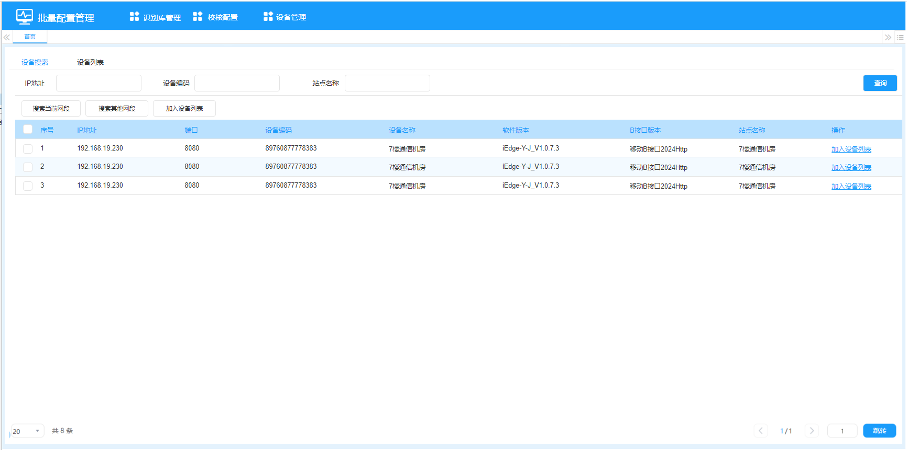

**搜索其他网段弹窗**：

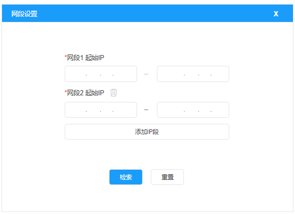

**设备列表**：

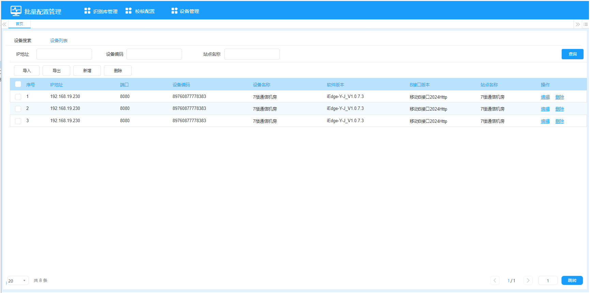

**新增/编辑设备弹窗**：

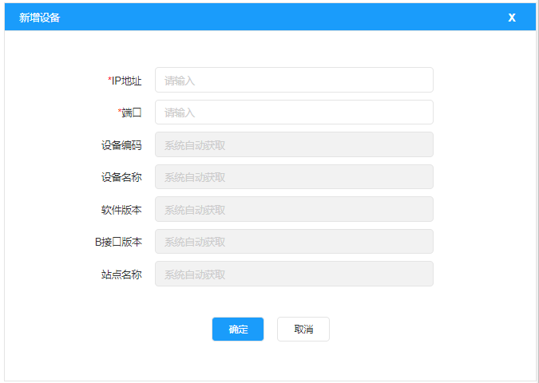

---

## 3 边端批量配置工具功能需求

### 3.1 OMC配置

#### 3.1.1 功能概述

配置OMC连接信息，配置后工具可从OMC获取识别库和校核配置数据。

#### 3.1.2 配置字段

| 字段 | 类型 | 必填 | 限制 | 默认值 |
|------|------|------|------|--------|
| IP地址 | 文本 | 是 | 格式：0.0.0.0 | 空 |
| 端口 | 数值 | 是 | 0-65535 | 空 |
| 用户名 | 文本 | 是 | 50字符 | 空 |
| 密码 | 文本 | 是 | 50字符，支持明密文切换 | 空 |

#### 3.1.3 业务规则

1. 配置成功后，自动从OMC获取一次识别库与校核配置数据
2. 每次点击确定都从OMC获取一次数据
3. 配置成功后，定时每天（时间可配置）从OMC获取数据更新

#### 3.1.4 原型界面

**批量配置工具主界面**：

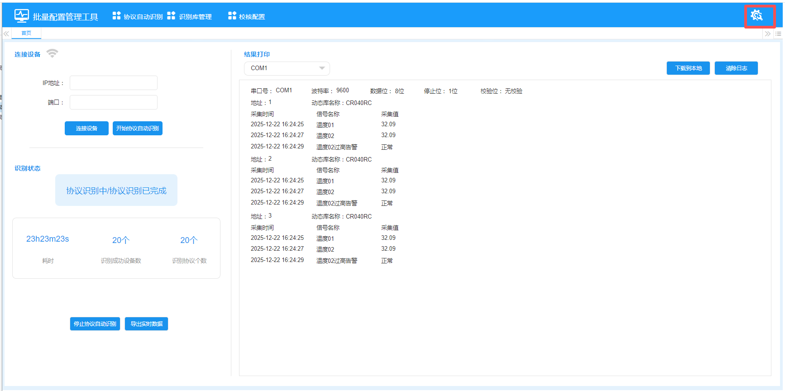

**OMC配置弹窗**：


---

### 3.2 协议自动识别

#### 3.2.1 功能概述

发起协议自动识别，查看识别过程和结果。系统打开时默认进入此页面。

#### 3.2.2 连接设备

| 字段 | 类型 | 必填 | 限制 |
|------|------|------|------|
| IP地址 | 文本 | 是 | 格式：0.0.0.0 |
| 端口 | 数值 | 是 | 0-65535 |

- 连接成功显示成功图标，失败显示失败图标
- 未连接成功时点击开始识别提示"请先成功连接设备"
- 重复点击提示"当前已经在协议自动识别中，请勿重复操作"

#### 3.2.3 识别状态

| 状态项 | 说明 |
|--------|------|
| 状态 | 待开始/协议识别中/协议识别完成 |
| 耗时 | 格式：XX小时XX分钟XX秒000毫秒 |
| 识别成功设备数 | 成功识别的设备计数，未开始时显示"--" |
| 识别协议个数 | 尝试识别的协议总数（含成功和失败），未开始时显示"--" |

#### 3.2.4 停止协议自动识别

- 仅在"协议识别中"状态可操作，其他状态按钮禁用

#### 3.2.5 导出实时数据

- Excel格式
- 字段：设备类型、设备子类、设备编码、信号名称、信号ID、信号类型、采集值、采集时间

#### 3.2.6 结果打印

- 识别开始后实时打印结果
- 成功和失败都打印，标注参数和实时数据
- 失败时显示失败原因
- 按串口查看，默认串口1，下拉切换
- **下载到本地**：txt格式，命名：COM{N}-{yyyyMMddHHmmss}
- **清除日志**：清除所有串口的日志

#### 3.2.7 原型界面

**协议自动识别主界面**：

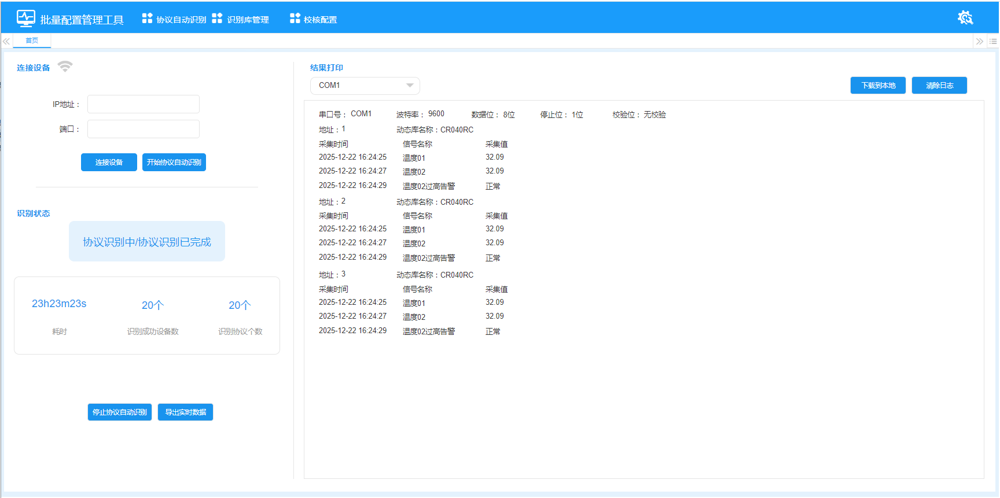

---

### 3.3 识别库管理

#### 3.3.1 功能概述

协议自动识别时的数据来源，用于判断识别优先级和协议信息。协议自动识别时，从此处获取数据来判断识别的优先级和相关协议信息。

#### 3.3.2 数据来源

1. 从OMC自动获取（相当于自动导入）
2. 无OMC时通过手动导入

#### 3.3.3 页面功能

参考云端OMC识别库管理（2.1节），功能一致。

#### 3.3.4 原型界面

**边端-识别库管理-动态库**：

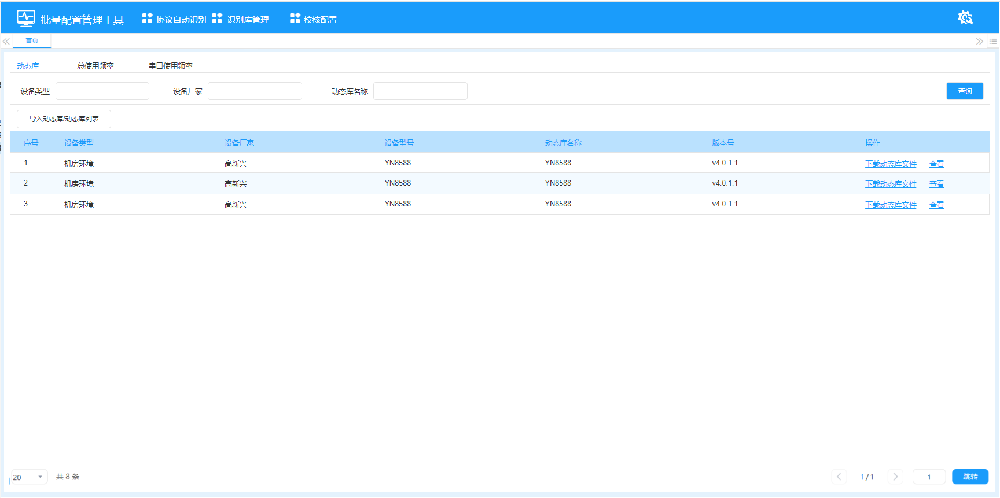

**边端-识别库管理-总使用频率**：

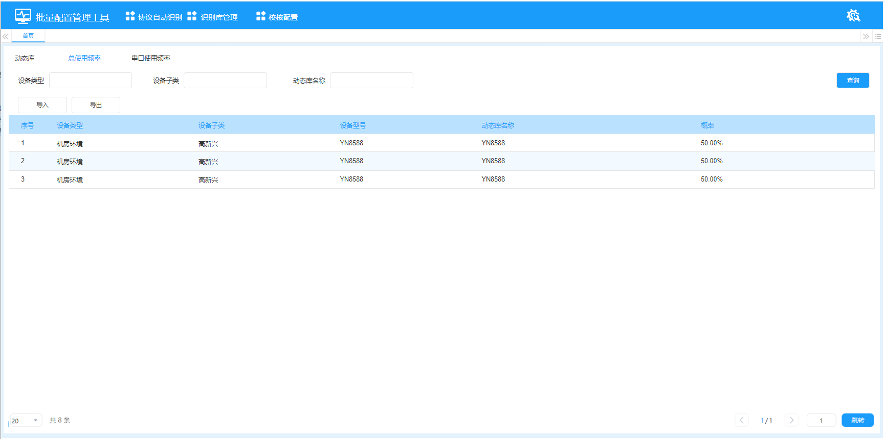

**边端-识别库管理-串口使用频率**：

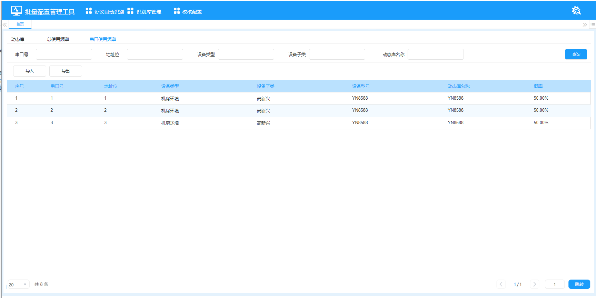

---

### 3.4 校核配置

#### 3.4.1 功能概述

识别过程中用于判断采集数据是否合法。主要在自动识别协议的过程中，采集到实时数据后，用来判断是否符合条件，若是符合，则协议正确，若是不符合，则协议不正确。

#### 3.4.2 数据来源

1. 从OMC自动获取
2. 无OMC时通过手动导入

#### 3.4.3 页面功能

参考云端OMC校核配置（2.2节），功能一致。

#### 3.4.4 原型界面

**边端-校核配置列表**：

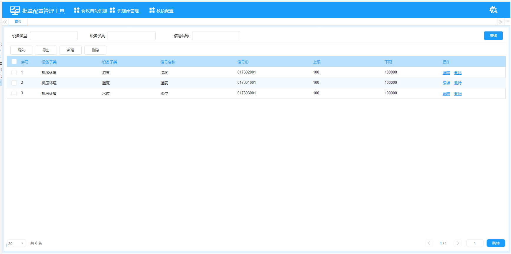

**边端-校核配置新增/编辑弹窗**：

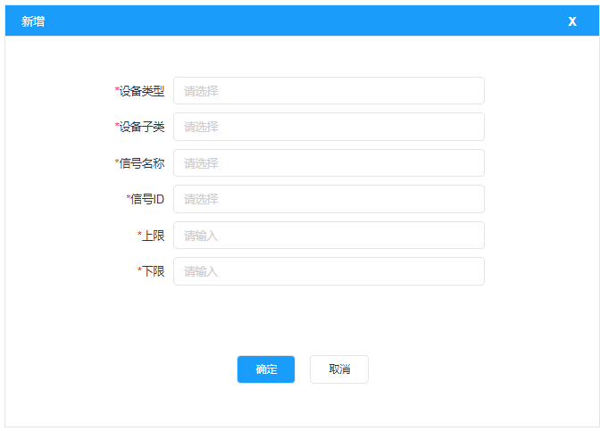

---

## 4 非功能需求

### 4.1 性能需求

| 指标 | 要求 |
|------|------|
| 页面加载时间 | ≤ 3秒 |
| 列表查询响应 | ≤ 2秒 |
| 文件导入（1000条） | ≤ 10秒 |
| 协议识别单设备 | ≤ 30秒 |
| 并发用户数 | OMC≥10，边端≥1 |

### 4.2 安全需求

- OMC配置密码加密存储和传输
- 设备连接使用认证机制
- 操作日志记录

### 4.3 兼容性需求

- 前端支持Chrome 80+、Firefox 78+、Edge 80+
- 云端后端支持Linux/Windows
- 边端后端支持Linux ARM/x86

### 4.4 可靠性需求

- 系统可用性≥99.5%
- 数据导入支持事务回滚
- 网络中断后自动重连

---

## 5 数据库设计概要

### 5.1 云端MySQL数据库（实例名：pai）

主要数据表：
- `omc_dynamic_library` - 动态库信息表
- `omc_dynamic_library_file` - 动态库文件表
- `omc_total_frequency` - 总使用频率表
- `omc_serial_frequency` - 串口使用频率表
- `omc_verify_config` - 校核配置表
- `omc_device` - 设备列表表
- `omc_device_config` - 设备配置数据表
- `omc_device_type` - 设备类型表
- `omc_device_subtype` - 设备子类表

### 5.2 边端SQLite数据库（i-edge.db）

复用现有表结构：
- `tab_dynamic_library` - 动态库信息
- `tab_dll_identify` - 动态库识别配置
- `tab_dll_identify_range` - 校核配置（信号范围校验）
- `tab_device` - 设备信息
- `tab_device_type` - 设备类型
- `tab_device_subtype` - 设备子类
- `tab_signal_dictionary` - 信号字典
- `tab_i_edge_info` - 边缘网关基本信息
- `tab_sc_server` - SC服务器配置

新增表：
- `tab_omc_config` - OMC配置表
- `tab_identify_result` - 协议识别结果表
- `tab_identify_realtime_data` - 识别实时数据表

---

## 6 接口需求

### 6.1 云端对外接口（供边端同步）

| 接口 | 方法 | 说明 |
|------|------|------|
| /api/omc/library/list | GET | 获取识别库列表 |
| /api/omc/library/download/{id} | GET | 下载动态库文件 |
| /api/omc/verify-config/list | GET | 获取校核配置列表 |
| /api/omc/device/config/{deviceCode} | GET | 获取设备配置数据 |

### 6.2 边端对云端接口

| 接口 | 方法 | 说明 |
|------|------|------|
| /api/edge/sync/library | POST | 同步识别库数据 |
| /api/edge/sync/verify-config | POST | 同步校核配置数据 |

---

## 7 修订历史

| 版本 | 日期 | 修改内容 | 修改人 |
|------|------|---------|--------|
| V1.0 | 2026-03-08 | 初始版本，基于原始需求文档补充完善 | make java |
